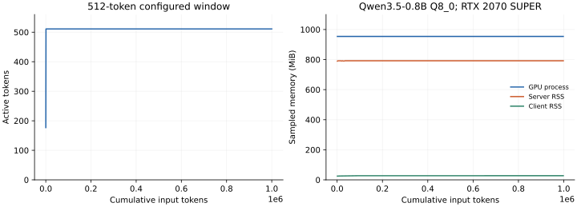
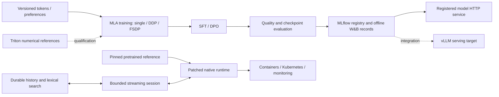

# InfiniteContext-1B

A language-model systems project with a configurable **996.5M-parameter MLA
architecture** and a durable streaming-context runtime. It covers training,
alignment, evaluation, model lifecycle, inference, kernels, and deployment.

The pretrained reference has processed **over one million input tokens through
a 512-token active window** on an 8 GiB GPU, including repeated eviction and
restart recovery. The custom MLA model has a tested training-to-registry-to-HTTP
pipeline at a small synthetic configuration. **The 1B configuration is untrained.**
These are separate evidence paths; the pretrained reference is not an MLA checkpoint.



The figure measures cumulative input, active tokens, and sampled process
memory. Persistent history grows on disk. A bounded window does not preserve
full attention over history or guarantee recall of evicted facts. See the
[results and limitations](docs/RESULTS.md), including retention failures.

## What runs

| Component | Implementation and evidence |
|---|---|
| MLA model | Latent KV projections, decoupled RoPE, absorbed decoding, materialized reference, causal cache, and a 996,520,448-parameter configuration; output/gradient/cache checks |
| Training | Packed token data, AdamW, checkpoint checksums, RNG/data cursor resume, DDP and FSDP paths; CPU/CUDA checks, exact CPU resume and two-process CPU DDP comparison |
| Alignment | Completion-only SFT and reference-relative sigmoid DPO through the same trainer; small synthetic pipeline check |
| Streaming | Pinned Qwen3.5-0.8B Q8_0 reference, position-aware llama.cpp patch, ordered SQLite history, bounded active tokens, idempotency, snapshots, replay, cancellation, and lexical history search |
| Evaluation | Sustained stream/resource measurement, recent/distant/conflicting/absent-fact probes, explicit retrieval comparison, and held-out checkpoint loss |
| Lifecycle | Offline W&B, local MLflow tracking/registry, evaluation-to-checkpoint identity, version promotion, HTTP prediction, and rollback/reload |
| Kernels | Triton RMSNorm, RoPE, and fused latent decoding with CPU interpreter comparisons; GPU performance and model integration remain pending |
| Operations | Verified native build, authenticated single-slot service, container/Compose recipe, Prometheus scrape, Kubernetes StatefulSet, and recovery checks |

[FSDP/NCCL scaling, vLLM integration, GPU kernel qualification, and the remaining
release gates](docs/STATUS.md) remain explicit work. The complete scope, including
Ansible, SLURM, TRL/torchtune integration, Grafana, Kubernetes/K3s and autoscaling,
is preserved in the [roadmap](docs/ROADMAP.md).

## Quick start

Linux, Python 3.12 or 3.13, a C++ compiler, Git, and CMake are required for the
native reference. Model download size is about 834 MB. Start with CPU checks:

On Ubuntu 24.04, install the build prerequisites with `sudo apt-get install
build-essential cmake git python3-venv libcurl4-openssl-dev`.

```bash
python3 -m venv .venv
. .venv/bin/activate
python -m pip install torch==2.8.0 --index-url https://download.pytorch.org/whl/cpu
python -m pip install -r requirements.txt
python -m unittest discover -s tests -v
python scripts/fetch_model.py
python scripts/build_runtime.py --backend cpu
python scripts/check_streaming.py --backend cpu --output .runs/stream-check
```

On a suitable CUDA host, build and check with `--backend cuda`. The harness
checks occupancy before starting and writes model/runtime identities, raw events,
resource samples, and a summary. It owns and stops its test server.

To keep a session running, start the backend in one terminal:

```bash
python -m serving.run --window 512
```

In another terminal, submit ordered JSONL records:

```bash
printf '%s\n' '{"id":"record-1","text":"The current station code is VIOLET-913.\n"}' \
  | python -m streaming.cli --window 512
```

Reuse an ID to retrieve its committed result; retry unfinished IDs before later
input. The `accepted`, provisional `delta`, and durable `complete` events have
different meanings. Chunk inputs to fit the active window and reserve space for
any generated output. [Streaming usage and recovery](docs/STREAMING.md) explains
the protocol, chat formatting, history search, and failure behavior.

## Reproduce the training pipeline

```bash
python -m pip install -r requirements-tracking.txt
python scripts/check_pipeline.py --work .runs/pipeline \
  --output .runs/pipeline-evidence.json
```

This executes small synthetic pretraining, SFT, DPO, held-out evaluation,
offline tracking, model registration, HTTP prediction, and rollback. It does
not train a useful natural-language model. Use the [training guide](docs/TRAINING.md)
for data requirements, checkpoint identity, distributed launches, and the
hardware boundary of the target configuration.

## System structure



- [Results](docs/RESULTS.md): measured behavior, raw evidence, and failure analysis.
- [Streaming](docs/STREAMING.md): runtime patch, session semantics, and reproduction.
- [Training](docs/TRAINING.md): data, architecture, SFT/DPO, tracking, and distributed execution.
- [Operations](docs/OPERATIONS.md): containers, monitoring, Kubernetes, and infrastructure.
- [Architecture](docs/ARCHITECTURE.md), [status](docs/STATUS.md),
  [roadmap](docs/ROADMAP.md), and [validation contract](docs/VALIDATION.md).
- [AGENTS.md](AGENTS.md): contributor instructions and evidence requirements.

The MLA implementation follows [DeepSeek-V2](https://github.com/deepseek-ai/DeepSeek-V2).
The retention policy draws on [StreamingLLM](https://github.com/mit-han-lab/streaming-llm).
The runtime patch extends [llama.cpp](https://github.com/ggml-org/llama.cpp), with
its MIT license retained under `patches/llama.cpp/`. These are attributed
engineering implementations; no algorithmic novelty or upstream acceptance is claimed.
