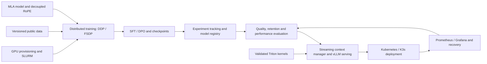

# InfiniteContext-1B

An end-to-end ML systems project for training, optimizing, evaluating, and
serving language models with memory-efficient, streaming context.

The full scope includes a 1B-class MLA model, distributed training, custom GPU
kernels, alignment, evaluation, inference serving, and production operations.
Streaming context adds the ability to keep processing a growing session under
an explicit active-memory budget. Each component needs its own implementation
and evidence; a serving demo alone does not complete the system.

## System scope

| Layer | Planned capability |
|---|---|
| Infrastructure | Ansible GPU provisioning, NVIDIA Container Toolkit, SLURM training jobs, and Kubernetes/K3s deployment |
| Model | Multi-Head Latent Attention (MLA), decoupled RoPE, configurable 1B-class architecture, and MHA/GQA comparisons |
| Training | Reproducible data pipelines, PyTorch DDP/FSDP, NCCL communication, checkpoint/resume, and scaling measurements |
| Streaming context | Retention/eviction, position handling, bounded KV/recurrent state, session continuity, and recovery |
| GPU optimization | Triton RoPE/RMSNorm and fused MLA decoding, with numerical checks and profiler-backed comparisons |
| Alignment | Supervised fine-tuning (SFT), TRL/torchtune-compatible workflows, and Direct Preference Optimization (DPO) |
| Evaluation | Retrieval/passkey tests, long-stream quality, historical recall, training efficiency, latency, throughput, and memory |
| Model lifecycle | W&B experiment records, MLflow model/artifact registry, versioned evaluation, promotion, and rollback |
| Serving | vLLM integration, bounded requests and concurrency, streaming responses, batching, and model identity |
| Operations | Health/readiness, monitoring with Prometheus/Grafana, Kubernetes rollout/autoscaling, load testing, and recovery |

The 1B model and extended context lengths are engineering targets. They become
supported capabilities only when the corresponding model, configuration, run,
and measurements exist.

## Architecture



MLA reduces the storage cost of retained KV states. Continued streaming also
requires explicit eviction, position/state handling, and a retention policy for
older information. The [architecture](docs/ARCHITECTURE.md) separates those
responsibilities and defines the resources that may grow with session history.

## Implementation status

The published baseline contains educational attention/KV-cache code and
synthetic development scripts. The remaining system is under development;
there is no published end-to-end training-to-streaming result yet.

See [current state](docs/STATUS.md) for component status. Planned infrastructure,
training, kernels, and serving directories may still contain placeholders.
Performance and context-length results will be reported with reproducible
artifacts rather than inferred from architecture names or target hardware.

## Documentation

- [Architecture](docs/ARCHITECTURE.md): components, data flow, streaming
  semantics, model strategy, and integration boundaries.
- [Roadmap and scope coverage](docs/ROADMAP.md): the complete delivery scope
  and dependency order.
- [Validation](docs/VALIDATION.md): the evidence needed for component and
  end-to-end completion.
- [Current state](docs/STATUS.md): implemented work, open problems, and next
  execution.
- [AGENTS.md](AGENTS.md): contributor instructions, scope preservation, and
  public/private information boundaries.

## Repository layout

```text
AGENTS.md             Contributor and agent contract
README.md             Project scope and navigation
docs/                 Architecture, roadmap, validation, and status
training/src/         Model architecture and training implementation
training/recipes/     Training and alignment configuration
training/slurm/       Distributed job launchers
training/evaluation/  Quality and long-context evaluation
kernels/              Triton implementations and benchmarks
serving/              Inference integration and deployment configuration
infra/                Ansible, SLURM, and infrastructure configuration
scripts/              Setup, development, and reproduction commands
```

## Evidence and contribution

A substantive change should include its baseline, runnable validation, model
and runtime identity, raw results, and limitations. Report compute scale,
quality, failures, latency, and memory together. Cite reused algorithms and
upstream implementations; engineering integration does not establish
algorithmic novelty.

Contributions should improve a concrete part of this system or resolve a
reproducible upstream problem. Preserve issue, test, review, and release
provenance when those artifacts exist.
